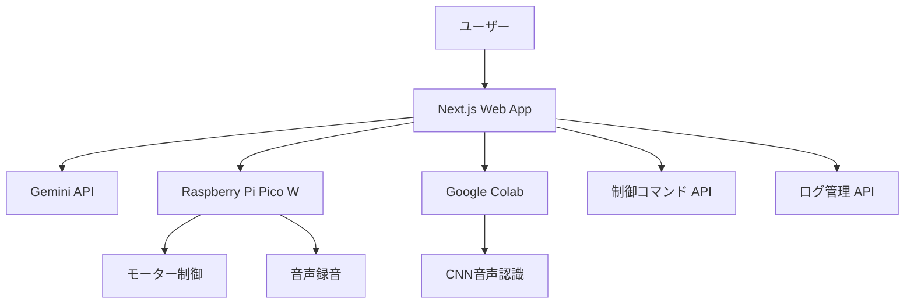

# システム設計書

## 概要

音声認識とAIチャットによるライントレースカー制御システム

## システム構成



## 主要コンポーネント

### 1. フロントエンド (Next.js)
- **チャットインターフェース**: 自然言語でのコマンド入力
- **手動制御パネル**: 直接的なボタン操作
- **システム状態監視**: リアルタイムステータス表示
- **ログビューアー**: 音声認識履歴の表示

### 2. バックエンド API
- **コマンド管理**: `/api/command`
- **ログ管理**: `/api/log`
- **システムテスト**: `/api/test/*`
- **コマンド抽出**: `/api/extract-command`

### 3. 外部システム
- **Raspberry Pi Pico W**: ハードウェア制御
- **Google Colab**: 音声認識処理
- **Gemini API**: 自然言語理解

## データフロー

1. **音声制御**:
   ```
   音声入力 → Pico W → Colab (CNN) → Web App → コマンド実行
   ```

2. **チャット制御**:
   ```
   テキスト入力 → Gemini API → コマンド抽出 → コマンド実行
   ```

## 作成日: 2025-09-10