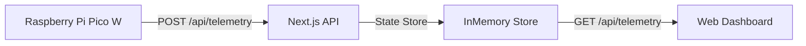

## システムアーキテクチャ

本プロジェクトは、組み込みハードウェア（Raspberry Pi Pico W）とモダンウェブフレームワーク（Next.js）をシームレスに統合したIoTシステムです。

### 構成図



※ 上記は概念図です。

1.  **Raspberry Pi Pico W**: センサーデータを取得し、JSON形式でAPIのエンドポイントに送信します。
2.  **Next.js API**: データを受信し、インメトリストア（シングルトン）に一時保存します。
3.  **Web Dashboard**: 定期的にAPIをポーリングして最新データを取得し、Reactコンポーネントで描画します。

### 通信プロトコル

データ通信はシンプルなHTTP POST/GETリクエストで行われます。これにより、WebSocketのような常時接続を維持する必要がなく、ファイアウォール環境下でも安定して動作します。

#### 送信データ形式 (POST)

エンドポイント: `/api/telemetry`

```json
{
  "sensors": [0, 1, 1, 1, 1, 1, 1, 0], 
  "timestamp": 1710928800000
}
```

- `sensors`: 8要素の配列。0が黒（ライン）、1が白（床）を表します。
- `timestamp`: データの取得時刻（Unixミリ秒）。

### 技術スタック

本プロジェクトで採用している主要な技術です。

| カテゴリ | 技術 | 解説 |
| --- | --- | --- |
| **Frontend** | Next.js 14 | App Routerを採用した最新のモダンフレームワーク |
| **Language** | TypeScript | 型安全性による堅牢なコードベース |
| **Styling** | Tailwind CSS | ユーティリティファーストなCSSフレームワーク |
| **Hardware** | MicroPython | Pico W制御用の軽量Python環境 |
| **Deploy** | Vercel | 高速なエッジネットワークへのデプロイ |

### 今後の展望

現在はインメモリでデータを管理していますが、長期間のログ分析のためにデータベース（PostgreSQLやSupabase）への永続化機能の実装を計画しています。また、強化学習モデルをブラウザ上で動かし、シミュレーションを行う機能の追加も検討中です。
